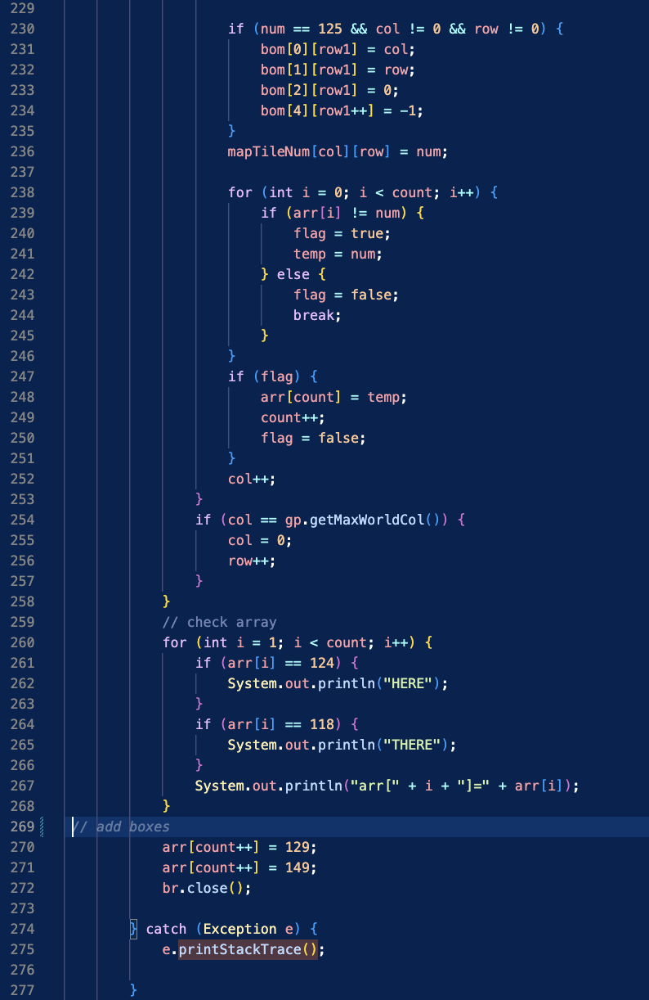

# SANASHIBAMY - OOP - Project
### International University - Semester 2 - 2022-2023

## Contributors

- [**Bui Doan The Sang**](https://github.com/nesgnas)
- [**Nguyen Huynh Thao My**](https://github.com/my003)
- [**Le Thu Hoang**](https://github.com/thuhoangle)
- [**Nguyen Huy Bao**](https://github.com/nguyenhuybao1108)
- [**Nguyen Tran Nguyen Anh**](https://github.com/Ntna1302)

## Table of contents

* [Introduction](#Introduction)
* [Game SANASHIBAMY](#The Project SANASHIBAMY)
* [OOP Concepts Implemented](#OOP Concepts Implemented)

## Introduction

### Motivation:
_During my investigation into how to create 2D games with Java. We remembered the Sokoban game, which was popular on ancient phones, and developed the Sanashiba game based on the classic gameplay from the Sokoban game genre._
### Task Allocation:
| No  | Name                           | ID          | Main Contributes                                                                                     |
| --- | ------------------------------ | ----------- | ---------------------------------------------------------------------------------------------------- |
| 1   | **Bui Doan The Sang**  | ITDSIU21104  | Make a report, create initial core structure of project, build flexing method load Map, develop idea checking collision for Object (Box). crawl position top and bottom for each room, deep copy ArrayList Boxes to BoxesCopy, apply Command Pattern in setting keyInput, using Comparable Interface to sort ArrayList Boxes. |
| 2   | **Nguyen Huynh Thao My** | ITDSIU21204  | Change the color of the box when pushed to the pink position and push out, check the complete mission (all boxes are overlap the pink position) to control open/close gate image, create menu option (including reset the position of all boxes in room back to the original feature).           | 
| 3   | **Nguyen Huy Bao**    | ITDSIU21076 | In charge of making box move and mouseclick.                 |
| 4   | **Le Thu Hoang**   | ITCSIU21063 | UI Designer, Game Player, Sound & Music, Quality Checker, Slides.                      |
| 5   | **Nguyen Tran Nguyen Anh**   | ITITWE20021 | Import and export map, coding sound for box when hit the target and game, handling user-interface code, contributing to the project,do the report, making PowerPoint slides.            |

### Technologies:
- 
- 
- 
- 

## The Project SANASHIBAMY

### Rule
* About the rules to play the game:
    * Player control: You control the player character, typically represented by a small character icon. The character can move horizontally or vertically one square at a time, but cannot move diagonally or pass through walls or boxes.
    * Moving Boxes: Boxes are typically represented by large squares. The goal is to push each box onto a target location. You can only push the boxes, never pull them. The boxes can only be pushed one at a time and can't be pushed into walls or other boxes.
    * Target Locations: The target locations are usually marked with a different pink color to indicate that a box should be placed there. Once all boxes are correctly placed on the target locations, you have completed the level.

* General:
    * Mouse Click:
        * Play Game : This is the bar to start the game when you click this bar.
        * Guide: This bar contains instructions on how to play the game when you click this bar.
        * Credits:  This bar contains the author and developer who made this game when you click this bar.
        * Exit: This bar is used to close the game when you click it.
        * Settings Panel: This sub window contains multiple effects of the game, you can click it to change the effects or reset the room.
    * Button:
        * Up arrow: press the key ‘W’ or ‘^’ to move the character up .
        * Left arrow: press the key ‘D’ or ‘>’  to move the character to the left.
        * Right arrow: press the key ‘A’ or ‘<’  to move the character to the right
        * Down arrow: press the key ‘S’ or ‘v’  to move the character down

### Design
* Background: We got ideas from the game's theme and colors and refered to online sources to create a background with a bright, natural background .
* Map: Using the GIMP and Tiled software to create tileset and draw map.
* Sound: Sound is added to create an enjoyable atmosphere, making the player more interesting.
* Welcome: The tittle is “SANASHIBAMY” which was added at the beginning. Moreover, we made it more colorful and eye-catching.
* Game attribute: Makes user friendly experience.

### Other
* [Presentation](https://www.canva.com/design/DAFj53jtDyQ/9DuNI22YatparYSimiVgqA/edit?utm_content=DAFj53jtDyQ&utm_campaign=designshare&utm_medium=link2&utm_source=sharebutton)
* References:
    * http://surl.li/hhwmy
    * https://www.epidemicsound.com/
    * https://www.behance.net

## OOP Concepts Implemented

### Command Pattern:
- We use this pattern to encapsulate all the key signal input from the keyboard to control the action of the player.
  
- **Diagram of Pattern:**

### Abstract Class:
- A superObject abstract class was created that is open for extension by many new objects. In this case, we just need one object (Box).

### Polymorphism
- Applying a polymorphism attribute so that we have many classes that are related to each other by inheritance.

**Example: InteractBox, Player [extend] Entity**

Player and interactBox was inheritance all attribute of Entity class

The idea is transform box[superObject] to be new entity which inheritance all the attribute from Entity

### Inheritance
- This is used for creating many subclasses from one superclass, this subclass has all attributes and methods from superclass.
  
**Example: Credits, Guide, Menu [extend] Background**

Credits, Guide, Menu was inheritance all method of Background class, and using @Overwrite to setting their own work

### Overriding
- Overriding occurs when a subclass contains the same method as the parent class. The overriding method's name, number and type of parameters, and return type are similar to those of the method it overrides.
 
**Example: Player [extend] Entity**
- In this case, the Players class extends the Entity class, so it overrides the speak method of its parent class ( Entity class).

### Implementing a runnable interface
- This is used for executing code on a thread when instancing the class.

**Example: gamePanel [implements] Runnable**

Overriding method in the separately executing thread when a thread is started by the object of any class which is implementing Runnable

### Implementing a comparable interface
- This is used to sort objects's positions in the box class by implementing a Comparable interface.

**Example: Box [implements] Comparable**

Writing the compareTo() method in such a way that, in the same room, if this is less than the passed box's position, then it should return negative, if greater than positive, and zero if equal

### Running Threads
- The method to call a Thread - often use this to make multitask in sametime.

Creating the game loop in run method, mean that, when the gameThread exists, it repeats the process that is written inside of these brackets

### File Handling
- The loadMap() method loads a map from a file. The method takes a file path as input. The method returns a map. The method works by first opening the file. Then, it reads the contents of the file line by line. For each line, the method splits the line into an array of strings. The method then uses the array of strings to create a tile. The method adds the tile to an array of tiles. Once the method has read all of the lines in the file, it closes the file. Finally, the method returns the array of tiles.

Creating maps based on text file and storing all value in a array

### Exception Handling
- The process of responding to unwanted or unexpected events when a computer program runs. Exception handling deals with these events to avoid the program or system crashing, and without this process, exceptions would disrupt the normal operation of a program.

To ensure correct image and file loading

### Launch:
- Game entrance is `src/main/java/main/Main.java`, run `main` method directly.

